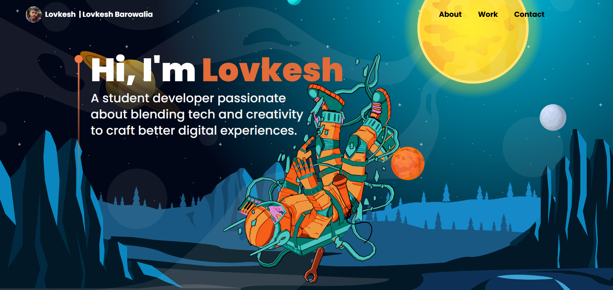

# 💼 Personal Portfolio – Lovkesh Barowalia

An interactive developer portfolio website built with **React.js**, **Three.js**, and **Tailwind CSS**. It showcases my skills, 3D visualizations, and development projects as a pre-final year B.Tech student at NIT Jalandhar.

---

## 🚀 Live Demo

👉 [https://portfolio-one-gray-86.vercel.app/](https://portfolio-one-gray-86.vercel.app/)

---

## 🛠️ Tech Stack

- **Frontend:** React.js, Tailwind CSS, Vite
- **3D Graphics:** Three.js, @react-three/fiber, @react-three/drei
- **Animations:** Framer Motion
- **UI Effects:** react-parallax-tilt
- **Deployment:** Vercel

---

## 📁 Features

- Modern, responsive portfolio layout
- Smooth animations using Framer Motion
- Interactive 3D models with Three.js
- Tilt hover effects on cards (react-parallax-tilt)
- Dynamic project showcase with GitHub links

---

## 🎮 3D Integration

This portfolio includes 3D models rendered using **Three.js** via the React-friendly `@react-three/fiber` library, allowing interactive and lightweight 3D scenes on the web.

---

## 📷 Screenshots

 

---
